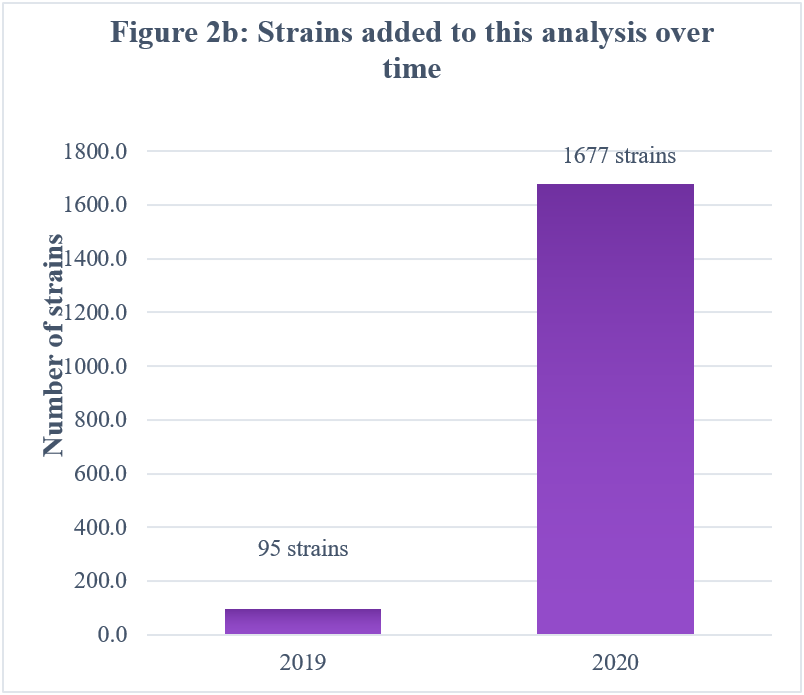
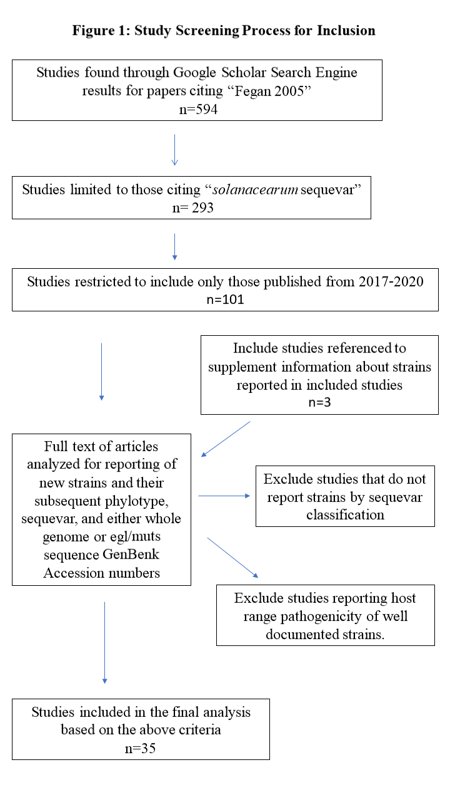
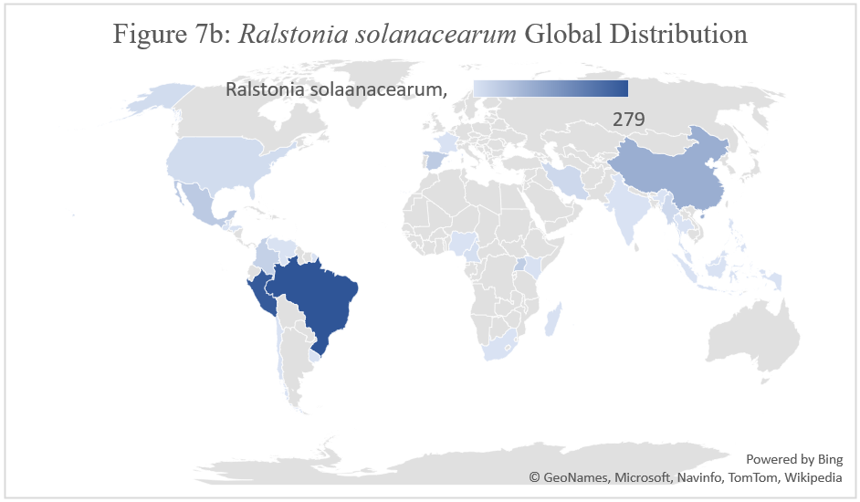
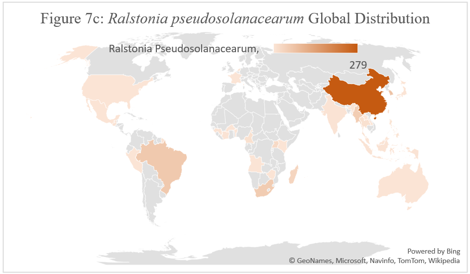
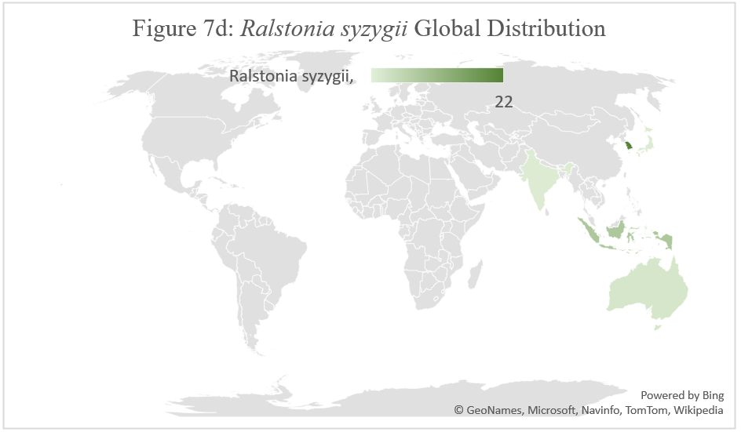

# Excerpts from Kyle Chipman's Thesis
Spring 2020

Kyle is the first GDB student to perform a systematic meta-analysis of *Ralstonia* distribution and host range. He added information from nearly 1,600 strains from 21 publications. 

Keep in mind that these figures reflect only a partial snapshot in the distribution and diversity of *Ralstonia*. 

## Kyle's methodology:

## Known Distributions of the Ralstonia species

You can email Tiffany for a copy of Kyle's thesis, but you must make sure that your thesis represents your own intellectual effort. 

## Papers that Kyle overlooked
Overall, Kyle made good judgements about which papers to include. But he missed a few. 
### 2019
https://apsjournals.apsnet.org/doi/full/10.1094/PDIS-04-18-0615-PDN

### 2018
https://www.frontiersin.org/articles/10.3389/fpls.2017.02209/full

### 2017
https://apsjournals.apsnet.org/doi/full/10.1094/PDIS-06-17-0889-PDN

These 3 are 2016, but Google scholar lists them as 2017 ... (?):
*	https://bsppjournals.onlinelibrary.wiley.com/doi/full/10.1111/ppa.12577
*	https://bsppjournals.onlinelibrary.wiley.com/doi/full/10.1111/ppa.12586 
*	https://bsppjournals.onlinelibrary.wiley.com/doi/full/10.1111/ppa.12661%4010.1111/%28ISSN%291365-3059.VIRecentResearchAfrica
