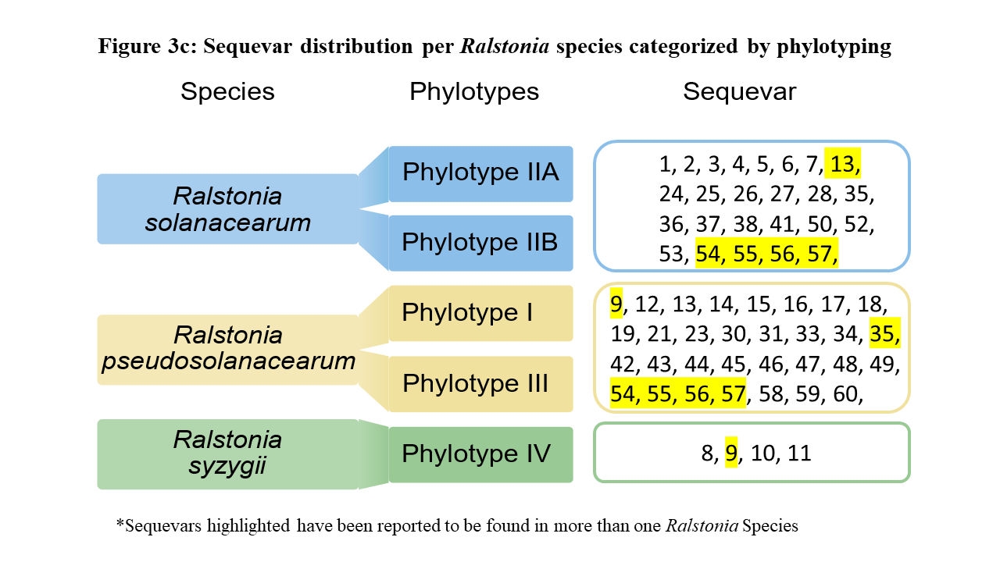
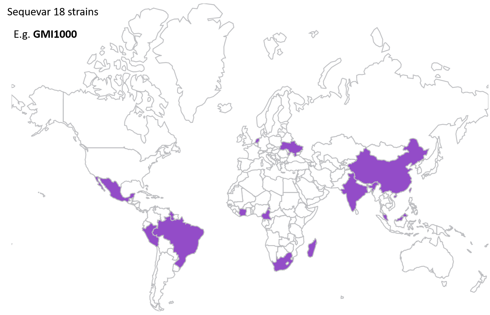
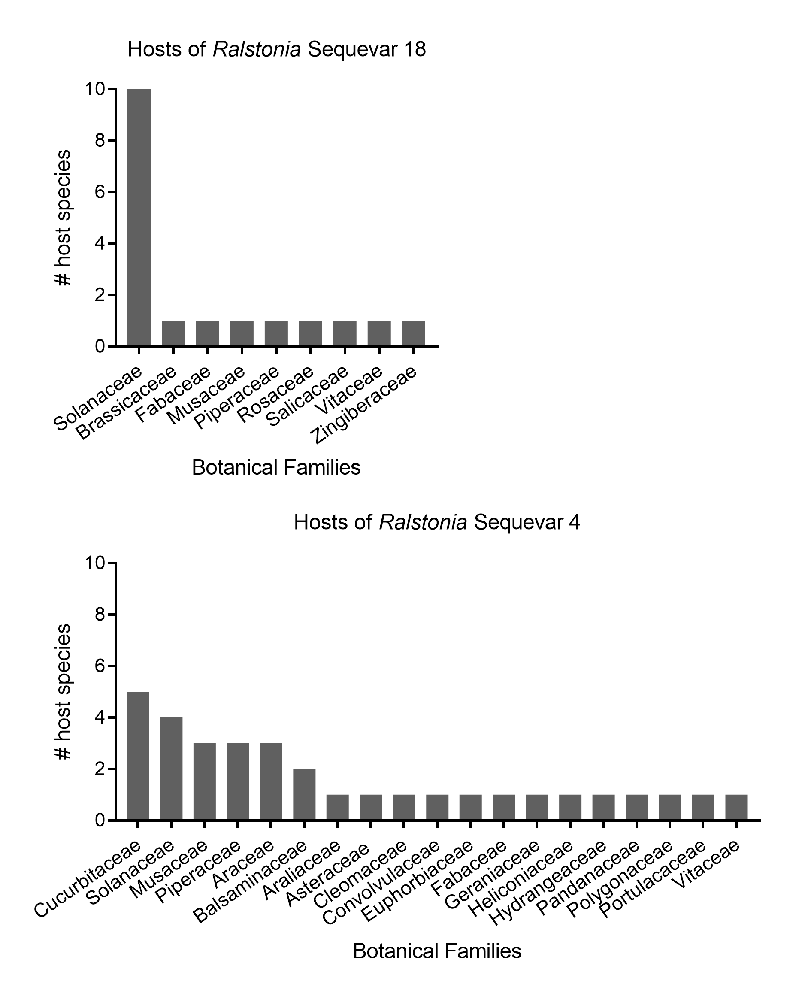

# Global Diversity of plant pathogenic *Ralstonia* strains
**[Spreadsheet of known Ralstonia diversity, host range, and locations](files/Ralstonia_diversity_hosts_locations.xls)**

Curated by UC Davis - Global Disease Biology Students

## Contributors:
Kyle Chipman, Spring 2020

## Purpose

Scientific knowledge about *Ralstonia* diversity, host range, and geographic location is fragmented as individual papers in the publication record. Our goal is to consolidate the knowledge as a database that is frequently updated by Global Disease Biology undergraduates at UC Davis. 

## Diversity/Taxonomy of *Ralstonia*

Fig 1. Taxonomy of *Ralstonia* at the Species, Phylotype, and Sequevar level. The sequevars highlighted in yellow have conflicting reports in the literature. Many of the conflicts are due to overlapping timing of paper publishing. 

The current classification scheme for Ralstonia is based on relative similarity of DNA sequences in the strains' genomes. *Ralstonia* is considered a species complex, i.e. a group of species that are closely inter-related. There are three formal species in the *Ralstonia* species complex: *R. solanacearum*, *R. pseudosolanacearum*, and *R. syzygii*. These three major divisions were recognized by Philippe Prior and Mark Fegan who built on earlier DNA-based phylogenetic groupings proposed by Doug Cook and Luis Sequiera. The three species were named in a 2015 publication by Safni et al. 

The species are subdivided into **phylotypes**, and phylotypes are subdivided into **sequevars**. The major divisions are *Ralstonia solanacearum* (phylotype II, which has IIA and IIB branches), *Ralstonia pseudosolanacearum* (phylotype I and III), and *Ralstonia syzygii* (phylotype IV). Sequevar is determined by the DNA sequence of the *egl* gene, which encodes an endoglucanase that is essential for *Ralstonia's* ability to degrade plant cell walls. Sequevars are numbered based on the timeline in which they were discovered. As of 2019, there are at least 54 sequevars. 

### Out-of-date naming schemes
* *Ralstonia* was historically named “*Pseudomonas solanacearum*” and, briefly, “*Burkholderia solanacearum*”.
* Before phylotype/sequevar, earlier methods attempted to classify *Ralstonia* strains by host range (“Race”) and sugar utilization patterns (“Biovars”). However, the host-range and sugar utilization patterns do not correspond to DNA-based phylogeny. 

## *Ralstonia* Host Range

This is a work in progress!  Papers often say that the Ralstonia host range includes over 250 plant species in over 50 botanical families.  We will see what we find!

## Methods for GDB students 

### Set up your Thesis Practicum
Email Dr. Tiffany Lowe-Power and ask whether she will advise you for your thesis practicum. [Advice for writing professional emails is in this article.](https://www.sciencemag.org/careers/2015/05/dear-dr-neufeld). Include information that is helpful to Dr. Lowe-Power:
* When is your estimated graduation date
* Why did you choose to be a GDB major?
* What are your career goal(s)?

### Read *"How complex is the Ralstonia solanacearum Species complex?"* by Fegan and Prior
* [Link to the chapter](/files/FeganPrior2005.pdf)

### Download the Spreadsheet
* Save the spreadsheet (above) on your computer.  To avoid losing your work in case your laptop dies or is stolen, I *strongly* recommend that you keep the file in folder that is automatically backed up to Box.com or Google Drive. 

* Explore the spreadsheet on your own.  Try to figure out how it is organized.  Then set up a meeting with Dr. Lowe-Power or a member of her lab for them to walk you through the spreadsheet. 

* For your practicum, I ask that you add information from at least 25 papers into the spreadsheet.  Then we will discuss meta-analyses that you can do to for your report. 

### Add new information to the spreadsheet.
* You are building on the previous work by Dr. Lowe-Power and other GDB students. Teamwork, yeah!

* Most sequevar papers cite the original Fegan and Prior chapter. You can use Google Scholar to find papers that cite Fegan & Prior:

* [Google Scholar link to papers that (1) cite Fegan and Prior and (2) include the word *sequevar*](https://scholar.google.com/scholar?hl=en&scisbd=1&as_sdt=2005&sciodt=0%2C5&cites=9627009798929581998&scipsc=1&q=&btnG=). As of May 2020, 243 papers match the search criteria. 

* Each GDB student will *systematically* add strains from 20-30 papers to the spreadsheet.  

**General tips**

* Before proceeding, read 3+ papers that are already in the spreadsheet and how previous students found everything.  It is important to look through not only the main body of the paper, but also the supplementary tables.  These supplemental tables usually contain all the details. 
* Next, find 1-2 papers and add their information to the table.  Send it to Tiffany or your mentor.  She will look over the spreadsheet for mistakes.  It is best to catch these early!  Don't feel bad about the mistakes. We expect you to make some at the beginning. Then we  expect you to learn to correct them yourself. 
* If you use the *drag-to-copy* feature of Excel, be very careful to correct Excel's mistakes. Although Excel will perfectly copy words like "tomato" to 20 rows, it likes to add "1" to any cell that ends in a number. So years might count up. The URLs to the papers might count up.  Make sure you correct these mistakes!
* Send weekly progress updates to Tiffany. Tiffany will provide feedback, look for signs of data entry mistakes, and suggest Excel and organization tricks to make work easier. 

### Visualize and Summarize the data
* After you have completed the data collection portion of the project, you will analyze the results by summarizing the data.  Aggregating the raw data as tables or figures can allow us to see patterns in the data. 

Here are a few ways we have looked at the data. You can choose to apply the same analyses we performed previously, but we also welcome creative ideas about the data. 

* [Kyle Chipman's visualizations in Spring 2020](2020_kyle.md)

####  Summary example: Geographic distributions

This is a work in progress. This project could be taken to the next level by a GDB researcher who wants to learn to code in R / ggmap and help us develop a reproductible workflow for mapping the raw data to country distributions. 

At a much less-efficient approach, students could color-in a world map in a graphic design software or use a web interface like https://www.amcharts.com/visited_countries/

For example, here is the (likely incomplete) distribution of phylotype I sequevar 18 strains. These strains include GMI1000, which is one of the best-studied *Ralstonia* strains. 

Fig 2. Distribution of phylotype I sequevar 18 *Ralstonia*. This figure was last rendered in 2019. 

#### Summary example: Comparing known host ranges

Collectively, *Ralstonia* strains infect hundreds of plants in dozens of botanical families. However, individual lineages have more narrow host ranges.  

Fig 3. Known host ranges for two sequevars of *Ralstonia*. This figure was last rendered in 2019. 