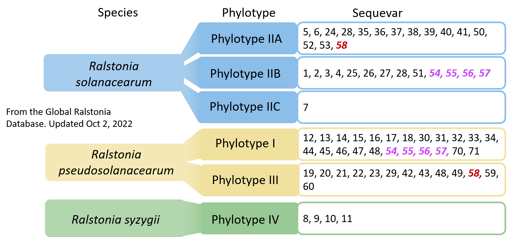

# Global Diversity of plant pathogenic *Ralstonia* strains
Curated by UC Davis - Global Disease Biology Students

## Contributors:
Kyle Chipman, Spring 2020

## Purpose

Scientific knowledge about *Ralstonia* diversity, host range, and geographic location is fragmented as individual papers in the publication record. Our goal is to consolidate the knowledge as a database that is frequently updated by Global Disease Biology undergraduates at UC Davis. 

## Diversity/Taxonomy of *Ralstonia*

The current classification scheme for Ralstonia is based on relative similarity of DNA sequences in the strains' genomes. *Ralstonia* is considered a species complex, i.e. a group of species that are closely inter-related. There are three formal species in the *Ralstonia* species complex: *R. solanacearum*, *R. pseudosolanacearum*, and *R. syzygii*. These three major divisions were recognized by Philippe Prior and Mark Fegan who built on earlier DNA-based phylogenetic groupings proposed by Doug Cook and Luis Sequiera. The three species were named in a 2015 publication by Safni et al. 

The species are subdivided into **phylotypes**, and phylotypes are subdivided into **sequevars**. The major divisions are *Ralstonia solanacearum* (phylotype II, which has IIA and IIB branches), *Ralstonia pseudosolanacearum* (phylotype I and III), and *Ralstonia syzygii* (phylotype IV). Sequevar is determined by the DNA sequence of the *egl* gene, which encodes an endoglucanase that is essential for *Ralstonia's* ability to degrade plant cell walls. Sequevars are numbered based on the timeline in which they were discovered. As of 2019, there are at least 54 sequevars. 

### Out-of-date naming schemes
* *Ralstonia* was historically named “*Pseudomonas solanacearum*” and, briefly, “*Burkholderia solanacearum*”.
* Before phylotype/sequevar, earlier methods attempted to classify *Ralstonia* strains by host range (“Race”) and sugar utilization patterns (“Biovars”). However, the host-range and sugar utilization patterns do not correspond to DNA-based phylogeny. 

